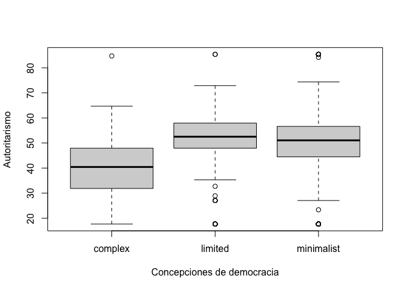

Taller 05
================
dacarras
Thu Apr 20, 2023

# Taller 5: regresión empleada para realizar comparaciones entre grupos

## Cargar datos

``` r
#----------------------------------------------------------
# cargar datos
#----------------------------------------------------------

#--------------------------------------
# cargar dplyr
#--------------------------------------

library(dplyr)

#--------------------------------------
# datos Vik (2014, p83)
#--------------------------------------

table_7_1 <- read.table(text = "
subject   score    group       dummy
      1       3    'No Dx'        -1
      2       5    'No Dx'        -1
      3       6    'No Dx'        -1
      4       8    'No Dx'        -1
      5       9    'No Dx'        -1
      6      11    'No Dx'        -1
      7      19    'Depressed'     1
      8      15    'Depressed'     1
      9      16    'Depressed'     1
     10      16    'Depressed'     1
     11      19    'Depressed'     1
     12      17    'Depressed'     1
     13       3    'No Dx'        -1
     14       5    'No Dx'        -1
     15       4    'No Dx'        -1
     16       6    'No Dx'        -1
     17       8    'No Dx'        -1
     18      10    'No Dx'        -1
     19      24    'Depressed'     1
     20      24    'Depressed'     1
     21      22    'Depressed'     1
     22      23    'Depressed'     1
     23      19    'Depressed'     1
     24      20    'Depressed'     1
", header = TRUE, stringsAsFactors = FALSE)

# --------------------------------------
# variables
#--------------------------------------

# score = puntaje de sintomas
# group = grupo diagnosticado (Depressed), 
#         y grupo no diagnosticado (No Dx)
```

# Comparación de aproximaciones

## Aplicación de pruebas

``` r
#----------------------------------------------------------
# aplicación de pruebas
#----------------------------------------------------------

#--------------------------------------
# t test
#--------------------------------------

t.test(score ~ group, var.equal=TRUE, data = table_7_1)
```

    ## 
    ##  Two Sample t-test
    ## 
    ## data:  score by group
    ## t = 10.836, df = 22, p-value = 2.749e-10
    ## alternative hypothesis: true difference in means between group Depressed and group No Dx is not equal to 0
    ## 95 percent confidence interval:
    ##  10.51188 15.48812
    ## sample estimates:
    ## mean in group Depressed     mean in group No Dx 
    ##                    19.5                     6.5

``` r
#--------------------------------------
# anova
#--------------------------------------

aov(score ~ dummy, data = table_7_1) %>%
summary()
```

    ##             Df Sum Sq Mean Sq F value   Pr(>F)    
    ## dummy        1   1014  1014.0   117.4 2.75e-10 ***
    ## Residuals   22    190     8.6                     
    ## ---
    ## Signif. codes:  0 '***' 0.001 '**' 0.01 '*' 0.05 '.' 0.1 ' ' 1

``` r
#--------------------------------------
# regresion
#--------------------------------------

lm(score ~ dummy, data = table_7_1) %>%
summary()
```

    ## 
    ## Call:
    ## lm(formula = score ~ dummy, data = table_7_1)
    ## 
    ## Residuals:
    ##    Min     1Q Median     3Q    Max 
    ##   -4.5   -2.5   -0.5    2.5    4.5 
    ## 
    ## Coefficients:
    ##             Estimate Std. Error t value Pr(>|t|)    
    ## (Intercept)  13.0000     0.5999   21.67 2.47e-16 ***
    ## dummy         6.5000     0.5999   10.84 2.75e-10 ***
    ## ---
    ## Signif. codes:  0 '***' 0.001 '**' 0.01 '*' 0.05 '.' 0.1 ' ' 1
    ## 
    ## Residual standard error: 2.939 on 22 degrees of freedom
    ## Multiple R-squared:  0.8422, Adjusted R-squared:  0.835 
    ## F-statistic: 117.4 on 1 and 22 DF,  p-value: 2.749e-10

## Extracción de estadísticos

``` r
#----------------------------------------------------------
# aplicación de pruebas
#----------------------------------------------------------

#--------------------------------------
# t test
#--------------------------------------

t_stat <- t.test(score ~ group, var.equal=TRUE, data = table_7_1) %>%
          broom::tidy() %>%
          dplyr::select(statistic) %>%
          dplyr::pull() %>%
          as.numeric()

#--------------------------------------
# anova
#--------------------------------------

f_stat1 <- aov(score ~ dummy, data = table_7_1) %>%
           broom::tidy() %>%
           dplyr::filter(term == 'dummy') %>%
           dplyr::select(statistic) %>%
           dplyr::pull() %>%
           as.numeric()

#--------------------------------------
# regresion
#--------------------------------------

f_stat2 <- lm(score ~ dummy, data = table_7_1) %>%
           broom::glance() %>%
           dplyr::select(statistic) %>%
           dplyr::pull() %>%
           as.numeric()
```

## Tabla comparando los estadisticos

``` r
#----------------------------------------------------------
# tabla de comparación
#----------------------------------------------------------

#--------------------------------------
# crear tabla
#--------------------------------------

table_1 <- data.frame(
procedimiento = c('t test', 'anova', 'regresion'),
estadigrafo  = c('t', 'F', 'F'),
valor = c(t_stat, f_stat1, f_stat2),
operacion = c('^2','=','='),
comun = c(t_stat^2, f_stat1, f_stat2)
)

#--------------------------------------
# mostrar tabla
#--------------------------------------

table_1 %>%
knitr::kable(., digits = 2)
```

| procedimiento | estadigrafo |  valor | operacion |  comun |
|:--------------|:------------|-------:|:----------|-------:|
| t test        | t           |  10.84 | ^2        | 117.41 |
| anova         | F           | 117.41 | =         | 117.41 |
| regresion     | F           | 117.41 | =         | 117.41 |

# Cómo crear dummy coding y deviation coding

## Cargar datos

``` r
#----------------------------------------------------------
# cargar datos
#----------------------------------------------------------

#--------------------------------------
# cargar dplyr
#--------------------------------------

library(dplyr)

#--------------------------------------
# datos Vik (2014, p83)
#--------------------------------------

table_7_1 <- read.table(text = "
subject   score    group       dummy
      1       3    'No Dx'        -1
      2       5    'No Dx'        -1
      3       6    'No Dx'        -1
      4       8    'No Dx'        -1
      5       9    'No Dx'        -1
      6      11    'No Dx'        -1
      7      19    'Depressed'     1
      8      15    'Depressed'     1
      9      16    'Depressed'     1
     10      16    'Depressed'     1
     11      19    'Depressed'     1
     12      17    'Depressed'     1
     13       3    'No Dx'        -1
     14       5    'No Dx'        -1
     15       4    'No Dx'        -1
     16       6    'No Dx'        -1
     17       8    'No Dx'        -1
     18      10    'No Dx'        -1
     19      24    'Depressed'     1
     20      24    'Depressed'     1
     21      22    'Depressed'     1
     22      23    'Depressed'     1
     23      19    'Depressed'     1
     24      20    'Depressed'     1
", header = TRUE, stringsAsFactors = FALSE)

# --------------------------------------
# variables
#--------------------------------------

# score = puntaje de sintomas
# group = grupo diagnosticado (Depressed), 
#         y grupo no diagnosticado (No Dx)
```

## Preparar datos

- Crear recodificación de variables categóricas
  - deviation coding
  - dummy coding

``` r
#----------------------------------------------------------
# crear dummies
#----------------------------------------------------------

#--------------------------------------
# recodificar variables
#--------------------------------------

data_model <- table_7_1 %>%
              dplyr::select(subject, score, group) %>%
              mutate(deviation = case_when(
                group == 'No Dx'     ~ -1, # sin diagnóstico
                group == 'Depressed' ~  1  # con diagnóstico
                )) %>%
              mutate(dummy = case_when(
                group == 'No Dx'     ~  0, # sin diagnóstico
                group == 'Depressed' ~  1  # con diagnóstico
                ))

# --------------------------------------
# mostrar datos
#--------------------------------------

data_model %>%
knitr::kable()
```

| subject | score | group     | deviation | dummy |
|--------:|------:|:----------|----------:|------:|
|       1 |     3 | No Dx     |        -1 |     0 |
|       2 |     5 | No Dx     |        -1 |     0 |
|       3 |     6 | No Dx     |        -1 |     0 |
|       4 |     8 | No Dx     |        -1 |     0 |
|       5 |     9 | No Dx     |        -1 |     0 |
|       6 |    11 | No Dx     |        -1 |     0 |
|       7 |    19 | Depressed |         1 |     1 |
|       8 |    15 | Depressed |         1 |     1 |
|       9 |    16 | Depressed |         1 |     1 |
|      10 |    16 | Depressed |         1 |     1 |
|      11 |    19 | Depressed |         1 |     1 |
|      12 |    17 | Depressed |         1 |     1 |
|      13 |     3 | No Dx     |        -1 |     0 |
|      14 |     5 | No Dx     |        -1 |     0 |
|      15 |     4 | No Dx     |        -1 |     0 |
|      16 |     6 | No Dx     |        -1 |     0 |
|      17 |     8 | No Dx     |        -1 |     0 |
|      18 |    10 | No Dx     |        -1 |     0 |
|      19 |    24 | Depressed |         1 |     1 |
|      20 |    24 | Depressed |         1 |     1 |
|      21 |    22 | Depressed |         1 |     1 |
|      22 |    23 | Depressed |         1 |     1 |
|      23 |    19 | Depressed |         1 |     1 |
|      24 |    20 | Depressed |         1 |     1 |

## Medias esperadas (deviation)

- Medias esperadas empleando *deviation coding*

``` r
#----------------------------------------------------------
# regresion como modelo estructural
#----------------------------------------------------------

# -----------------------------------------------
# define model
# -----------------------------------------------

regression_equations <-'
score ~ b*deviation       # beta
score ~ a*1               # intercepto

# medias esperadas
group_1  := a - 1*b       # media grupo 1
group_2  := a + 1*b       # media grupo 2
delta    := 2*b           # diferencia de medias
'

# -----------------------------------------------
# fit model
# -----------------------------------------------

fitted_model <- lavaan::sem(regression_equations, 
                 mimic = 'MPLUS',
                 data = data_model)

# -----------------------------------------------
# display summary
# -----------------------------------------------

lavaan::summary(fitted_model, 
  fit.measures=TRUE,
  standardized=TRUE,
  rsquare=TRUE)
```

    ## lavaan 0.6-12 ended normally after 1 iterations
    ## 
    ##   Estimator                                         ML
    ##   Optimization method                           NLMINB
    ##   Number of model parameters                         3
    ## 
    ##   Number of observations                            24
    ##   Number of missing patterns                         1
    ## 
    ## Model Test User Model:
    ##                                                       
    ##   Test statistic                                 0.000
    ##   Degrees of freedom                                 0
    ## 
    ## Model Test Baseline Model:
    ## 
    ##   Test statistic                                44.313
    ##   Degrees of freedom                                 1
    ##   P-value                                        0.000
    ## 
    ## User Model versus Baseline Model:
    ## 
    ##   Comparative Fit Index (CFI)                    1.000
    ##   Tucker-Lewis Index (TLI)                       1.000
    ## 
    ## Loglikelihood and Information Criteria:
    ## 
    ##   Loglikelihood user model (H0)                -58.882
    ##   Loglikelihood unrestricted model (H1)        -58.882
    ##                                                       
    ##   Akaike (AIC)                                 123.764
    ##   Bayesian (BIC)                               127.298
    ##   Sample-size adjusted Bayesian (BIC)          118.004
    ## 
    ## Root Mean Square Error of Approximation:
    ## 
    ##   RMSEA                                          0.000
    ##   90 Percent confidence interval - lower         0.000
    ##   90 Percent confidence interval - upper         0.000
    ##   P-value RMSEA <= 0.05                             NA
    ## 
    ## Standardized Root Mean Square Residual:
    ## 
    ##   SRMR                                           0.000
    ## 
    ## Parameter Estimates:
    ## 
    ##   Standard errors                             Standard
    ##   Information                                 Observed
    ##   Observed information based on                Hessian
    ## 
    ## Regressions:
    ##                    Estimate  Std.Err  z-value  P(>|z|)   Std.lv  Std.all
    ##   score ~                                                               
    ##     deviation  (b)    6.500    0.574   11.317    0.000    6.500    0.918
    ## 
    ## Intercepts:
    ##                    Estimate  Std.Err  z-value  P(>|z|)   Std.lv  Std.all
    ##    .score      (a)   13.000    0.574   22.635    0.000   13.000    1.835
    ## 
    ## Variances:
    ##                    Estimate  Std.Err  z-value  P(>|z|)   Std.lv  Std.all
    ##    .score             7.917    2.285    3.464    0.001    7.917    0.158
    ## 
    ## R-Square:
    ##                    Estimate
    ##     score             0.842
    ## 
    ## Defined Parameters:
    ##                    Estimate  Std.Err  z-value  P(>|z|)   Std.lv  Std.all
    ##     group_1           6.500    0.812    8.003    0.000    6.500    0.918
    ##     group_2          19.500    0.812   24.008    0.000   19.500    2.753
    ##     delta            13.000    1.149   11.317    0.000   13.000    1.835

``` r
#------------------------------------------------
# medias esperadas
#------------------------------------------------

lavaan::parameterEstimates(fitted_model)%>% 
dplyr::filter(op == ':=') %>%
knitr::kable(., digits = 2)
```

| lhs     | op  | rhs    | label   |  est |   se |     z | pvalue | ci.lower | ci.upper |
|:--------|:----|:-------|:--------|-----:|-----:|------:|-------:|---------:|---------:|
| group_1 | :=  | a-1\*b | group_1 |  6.5 | 0.81 |  8.00 |      0 |     4.91 |     8.09 |
| group_2 | :=  | a+1\*b | group_2 | 19.5 | 0.81 | 24.01 |      0 |    17.91 |    21.09 |
| delta   | :=  | 2\*b   | delta   | 13.0 | 1.15 | 11.32 |      0 |    10.75 |    15.25 |

``` r
#------------------------------------------------
# medias por grupo
#------------------------------------------------

data_model %>%
group_by(deviation) %>%
summarize(
  mean = mean(score, na.rm = TRUE)
  ) %>%
knitr::kable(., digits = 2)
```

| deviation | mean |
|----------:|-----:|
|        -1 |  6.5 |
|         1 | 19.5 |

## Medias esperadas (dummy)

- Medias esperadas empleando *dummy coding*

``` r
#----------------------------------------------------------
# regresion
#----------------------------------------------------------

# -----------------------------------------------
# define model
# -----------------------------------------------

regression_equations <-'
score ~ b*dummy       # beta
score ~ a*1           # intercepto

# medias esperadas
group_1  := a         # media grupo 1
group_2  := a + 1*b   # media grupo 2
delta    := b         # diferencia de medias
'

# -----------------------------------------------
# fit model
# -----------------------------------------------

fitted_model <- lavaan::sem(regression_equations, 
                 mimic = 'MPLUS',
                 data = data_model)

# -----------------------------------------------
# display summary
# -----------------------------------------------

lavaan::summary(fitted_model, 
  fit.measures=TRUE,
  standardized=TRUE,
  rsquare=TRUE)
```

    ## lavaan 0.6-12 ended normally after 12 iterations
    ## 
    ##   Estimator                                         ML
    ##   Optimization method                           NLMINB
    ##   Number of model parameters                         3
    ## 
    ##   Number of observations                            24
    ##   Number of missing patterns                         1
    ## 
    ## Model Test User Model:
    ##                                                       
    ##   Test statistic                                 0.000
    ##   Degrees of freedom                                 0
    ## 
    ## Model Test Baseline Model:
    ## 
    ##   Test statistic                                44.313
    ##   Degrees of freedom                                 1
    ##   P-value                                        0.000
    ## 
    ## User Model versus Baseline Model:
    ## 
    ##   Comparative Fit Index (CFI)                    1.000
    ##   Tucker-Lewis Index (TLI)                       1.000
    ## 
    ## Loglikelihood and Information Criteria:
    ## 
    ##   Loglikelihood user model (H0)                -58.882
    ##   Loglikelihood unrestricted model (H1)        -58.882
    ##                                                       
    ##   Akaike (AIC)                                 123.764
    ##   Bayesian (BIC)                               127.298
    ##   Sample-size adjusted Bayesian (BIC)          118.004
    ## 
    ## Root Mean Square Error of Approximation:
    ## 
    ##   RMSEA                                          0.000
    ##   90 Percent confidence interval - lower         0.000
    ##   90 Percent confidence interval - upper         0.000
    ##   P-value RMSEA <= 0.05                             NA
    ## 
    ## Standardized Root Mean Square Residual:
    ## 
    ##   SRMR                                           0.000
    ## 
    ## Parameter Estimates:
    ## 
    ##   Standard errors                             Standard
    ##   Information                                 Observed
    ##   Observed information based on                Hessian
    ## 
    ## Regressions:
    ##                    Estimate  Std.Err  z-value  P(>|z|)   Std.lv  Std.all
    ##   score ~                                                               
    ##     dummy      (b)   13.000    1.149   11.317    0.000   13.000    0.918
    ## 
    ## Intercepts:
    ##                    Estimate  Std.Err  z-value  P(>|z|)   Std.lv  Std.all
    ##    .score      (a)    6.500    0.812    8.003    0.000    6.500    0.918
    ## 
    ## Variances:
    ##                    Estimate  Std.Err  z-value  P(>|z|)   Std.lv  Std.all
    ##    .score             7.917    2.285    3.464    0.001    7.917    0.158
    ## 
    ## R-Square:
    ##                    Estimate
    ##     score             0.842
    ## 
    ## Defined Parameters:
    ##                    Estimate  Std.Err  z-value  P(>|z|)   Std.lv  Std.all
    ##     group_1           6.500    0.812    8.003    0.000    6.500    0.918
    ##     group_2          19.500    0.812   24.008    0.000   19.500    1.835
    ##     delta            13.000    1.149   11.317    0.000   13.000    0.918

``` r
#------------------------------------------------
# medias esperadas
#------------------------------------------------

lavaan::parameterEstimates(fitted_model)%>% 
dplyr::filter(op == ':=') %>%
knitr::kable(., digits = 2)
```

| lhs     | op  | rhs    | label   |  est |   se |     z | pvalue | ci.lower | ci.upper |
|:--------|:----|:-------|:--------|-----:|-----:|------:|-------:|---------:|---------:|
| group_1 | :=  | a      | group_1 |  6.5 | 0.81 |  8.00 |      0 |     4.91 |     8.09 |
| group_2 | :=  | a+1\*b | group_2 | 19.5 | 0.81 | 24.01 |      0 |    17.91 |    21.09 |
| delta   | :=  | b      | delta   | 13.0 | 1.15 | 11.32 |      0 |    10.75 |    15.25 |

``` r
#------------------------------------------------
# medias por grupo
#------------------------------------------------

data_model %>%
group_by(dummy) %>%
summarize(
  mean = mean(score, na.rm = TRUE)
  ) %>%
knitr::kable(., digits = 2)
```

| dummy | mean |
|------:|-----:|
|     0 |  6.5 |
|     1 | 19.5 |

# Ejemplo práctico

- Comparación de medias empleando regresión
  - Variable de respuesta: creencias antidemocráticas
  - Variable categórica: concepciones de democracia

## Abrir datos

``` r
#----------------------------------------------------------
# abrir datos
#----------------------------------------------------------

# -----------------------------------------------
# abrir datos
# -----------------------------------------------

data_16 <- read.csv(
url('https://raw.githubusercontent.com/dacarras/psi4035_examples/master/data/dem_16.csv')
)

# -----------------------------------------------
# inspreccionar datos
# -----------------------------------------------

dplyr::glimpse(data_16)
```

    ## Rows: 2,500
    ## Columns: 12
    ## $ id_i      <int> 8093, 9243, 7484, 7187, 9208, 6863, 8736, 9067, 9691, 7096, …
    ## $ ctry      <chr> "Chile", "Chile", "Chile", "Chile", "Chile", "Chile", "Chile…
    ## $ sex       <int> 1, 0, 0, 0, 1, 1, 0, 1, 0, 1, 0, 1, 0, 0, 1, 0, 0, 1, 1, 1, …
    ## $ age       <dbl> 13.50, 13.83, 14.17, 14.50, 13.42, 13.33, 13.92, 13.42, 14.2…
    ## $ dem       <int> 2, 3, 3, 2, 1, 2, 3, 2, 3, 1, 1, 1, 1, 2, 3, 2, 1, 2, 2, 2, …
    ## $ dem_group <chr> "complex", "limited", "limited", "complex", "minimalist", "c…
    ## $ aut       <dbl> 42.55, 57.94, 17.67, 17.67, 38.07, 47.94, 59.24, 51.06, 27.0…
    ## $ civ       <dbl> 514.89, 334.68, 527.46, 612.81, 479.65, 556.01, 548.08, 391.…
    ## $ ses       <dbl> -0.19, -0.56, -0.23, -0.81, -0.17, 1.08, -1.03, -0.54, 0.01,…
    ## $ edu       <int> 0, 0, 0, 0, 0, 1, 0, 0, 0, 0, 0, 0, 0, 1, 0, 1, 1, 0, 0, 1, …
    ## $ level     <int> 2, 0, 2, 3, 2, 2, 2, 0, 2, 2, 1, 0, 0, 2, 1, 2, 2, 3, 2, 3, …
    ## $ level_lab <chr> "level 2", "level 0", "level 2", "level 3", "level 2", "leve…

## Listado de variables

``` text

# variable

id_i      = id único del caso
ctry      = nombre del país
sex       = sexo del estudiante
age       = edad del estudiante en años
dem       = perfil de concepciones de las democracia (1 = minimalista, 2 = complejo, 3 = limitado)
dem_group = perfil de concepciones de las democracia (en texto)
aut       = creencias antidemocráticas 
civ       = conocimiento cívico 
ses       = nivel socioecónomico 
edu       = educación de los padres (1 = educación universitaria, 0 = otro nivel educativo)
level     = niveles de conocimiento cívico (numérico) (3 = alta sofisticación, 2 = medio, 1 = bajo, 0 = muy bajo)
level_lab = niveles de conocimiento cívico (Level 3 = alta sofisticación, Level 2 = medio, Level 1 = bajo, Level 0 = muy bajo)
```

## Medias esperadas

``` r
#----------------------------------------------------------
# medias esperadas
#----------------------------------------------------------

#------------------------------------------------
# descriptivos
#------------------------------------------------

data_16 %>%
group_by(dem, dem_group) %>%
summarize(
  mean = mean(aut, na.rm = TRUE),
  sd   = sd(aut, na.rm = TRUE),
  n = sum(!is.na(aut))
  ) %>%
knitr::kable(., digits = 2)
```

    ## `summarise()` has grouped output by 'dem'. You can override using the `.groups`
    ## argument.

| dem | dem_group  |  mean |    sd |    n |
|----:|:-----------|------:|------:|-----:|
|   1 | minimalist | 50.62 | 10.77 | 1687 |
|   2 | complex    | 39.48 | 11.27 |  333 |
|   3 | limited    | 52.17 | 10.40 |  463 |

``` r
# -----------------------------------------------
# boxplot
# -----------------------------------------------

boxplot(aut~dem_group,
  data = data_16,
  xlab = "Concepciones de democracia",
  ylab = "Autoritarismo"
  )
```

<!-- -->

``` r
# -----------------------------------------------
# regresion
# -----------------------------------------------

lm(aut ~ as.factor(dem), data = data_16) %>%
summary()
```

    ## 
    ## Call:
    ## lm(formula = aut ~ as.factor(dem), data = data_16)
    ## 
    ## Residuals:
    ##     Min      1Q  Median      3Q     Max 
    ## -34.497  -4.359   0.441   6.011  45.260 
    ## 
    ## Coefficients:
    ##                 Estimate Std. Error t value Pr(>|t|)    
    ## (Intercept)      50.6188     0.2623 193.004   <2e-16 ***
    ## as.factor(dem)2 -11.1386     0.6460 -17.244   <2e-16 ***
    ## as.factor(dem)3   1.5482     0.5652   2.739   0.0062 ** 
    ## ---
    ## Signif. codes:  0 '***' 0.001 '**' 0.01 '*' 0.05 '.' 0.1 ' ' 1
    ## 
    ## Residual standard error: 10.77 on 2480 degrees of freedom
    ##   (17 observations deleted due to missingness)
    ## Multiple R-squared:  0.1189, Adjusted R-squared:  0.1181 
    ## F-statistic: 167.3 on 2 and 2480 DF,  p-value: < 2.2e-16

``` r
#------------------------------------------------
# crear variables dummy
#------------------------------------------------

data_model <- data_16 %>%
              mutate(d1 = case_when(
                dem_group == 'minimalist' ~ 1,
                dem_group == 'complex'    ~ 0,
                dem_group == 'limited'    ~ 0
                )) %>%
              mutate(d2 = case_when(
                dem_group == 'minimalist' ~ 0,
                dem_group == 'complex'    ~ 1,
                dem_group == 'limited'    ~ 0
                )) %>%
              mutate(d3 = case_when(
                dem_group == 'minimalist' ~ 0,
                dem_group == 'complex'    ~ 0,
                dem_group == 'limited'    ~ 1
                ))
# -----------------------------------------------
# define model
# -----------------------------------------------

regression_equations <-'
aut   ~ b2*d3          # beta_2
aut   ~ b1*d2          # beta_1
aut   ~ a*1            # intercepto

# medias esperadas
group_1  := a          # media grupo 1 (minimalist)
group_2  := a + b1     # media grupo 2 (complex)
group_3  := a + b2     # media grupo 3 (limited)
delta_1  := group_1 - group_3 # diferencia entre minimalist vs limited
'

# -----------------------------------------------
# fit model
# -----------------------------------------------

fitted_model <- lavaan::sem(regression_equations, 
                 mimic = 'MPLUS',
                 data = data_model)

# -----------------------------------------------
# display summary
# -----------------------------------------------

lavaan::summary(fitted_model, 
  fit.measures=TRUE,
  standardized=TRUE,
  rsquare=TRUE)
```

    ## lavaan 0.6-12 ended normally after 17 iterations
    ## 
    ##   Estimator                                         ML
    ##   Optimization method                           NLMINB
    ##   Number of model parameters                         4
    ## 
    ##   Number of observations                          2500
    ##   Number of missing patterns                         2
    ## 
    ## Model Test User Model:
    ##                                                       
    ##   Test statistic                                 0.000
    ##   Degrees of freedom                                 0
    ## 
    ## Model Test Baseline Model:
    ## 
    ##   Test statistic                               314.189
    ##   Degrees of freedom                                 2
    ##   P-value                                        0.000
    ## 
    ## User Model versus Baseline Model:
    ## 
    ##   Comparative Fit Index (CFI)                    1.000
    ##   Tucker-Lewis Index (TLI)                       1.000
    ## 
    ## Loglikelihood and Information Criteria:
    ## 
    ##   Loglikelihood user model (H0)              -9423.730
    ##   Loglikelihood unrestricted model (H1)      -9423.730
    ##                                                       
    ##   Akaike (AIC)                               18855.460
    ##   Bayesian (BIC)                             18878.756
    ##   Sample-size adjusted Bayesian (BIC)        18866.047
    ## 
    ## Root Mean Square Error of Approximation:
    ## 
    ##   RMSEA                                          0.000
    ##   90 Percent confidence interval - lower         0.000
    ##   90 Percent confidence interval - upper         0.000
    ##   P-value RMSEA <= 0.05                             NA
    ## 
    ## Standardized Root Mean Square Residual:
    ## 
    ##   SRMR                                           0.000
    ## 
    ## Parameter Estimates:
    ## 
    ##   Standard errors                             Standard
    ##   Information                                 Observed
    ##   Observed information based on                Hessian
    ## 
    ## Regressions:
    ##                    Estimate  Std.Err  z-value  P(>|z|)   Std.lv  Std.all
    ##   aut ~                                                                 
    ##     d3        (b2)    1.548    0.565    2.741    0.006    1.548    0.052
    ##     d2        (b1)  -11.139    0.646  -17.254    0.000  -11.139   -0.330
    ## 
    ## Intercepts:
    ##                    Estimate  Std.Err  z-value  P(>|z|)   Std.lv  Std.all
    ##    .aut        (a)   50.619    0.262  193.121    0.000   50.619    4.415
    ## 
    ## Variances:
    ##                    Estimate  Std.Err  z-value  P(>|z|)   Std.lv  Std.all
    ##    .aut             115.899    3.289   35.235    0.000  115.899    0.882
    ## 
    ## R-Square:
    ##                    Estimate
    ##     aut               0.118
    ## 
    ## Defined Parameters:
    ##                    Estimate  Std.Err  z-value  P(>|z|)   Std.lv  Std.all
    ##     group_1          50.619    0.262  193.121    0.000   50.619    4.415
    ##     group_2          39.480    0.590   66.921    0.000   39.480    4.084
    ##     group_3          52.167    0.500  104.267    0.000   52.167    4.467
    ##     delta_1          -1.548    0.565   -2.741    0.006   -1.548   -0.052

``` r
#------------------------------------------------
# medias esperadas
#------------------------------------------------

lavaan::parameterEstimates(fitted_model)%>% 
dplyr::filter(op == ':=') %>%
knitr::kable(., digits = 2)
```

| lhs     | op  | rhs             | label   |   est |   se |      z | pvalue | ci.lower | ci.upper |
|:--------|:----|:----------------|:--------|------:|-----:|-------:|-------:|---------:|---------:|
| group_1 | :=  | a               | group_1 | 50.62 | 0.26 | 193.12 |   0.00 |    50.11 |    51.13 |
| group_2 | :=  | a+b1            | group_2 | 39.48 | 0.59 |  66.92 |   0.00 |    38.32 |    40.64 |
| group_3 | :=  | a+b2            | group_3 | 52.17 | 0.50 | 104.27 |   0.00 |    51.19 |    53.15 |
| delta_1 | :=  | group_1-group_3 | delta_1 | -1.55 | 0.56 |  -2.74 |   0.01 |    -2.66 |    -0.44 |
